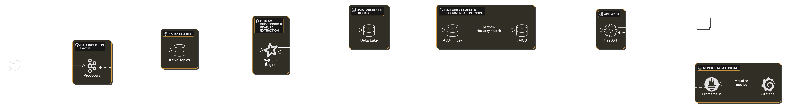

# Real-Time Twitter Follower Recommendation System

A concise, enterprise-grade pipeline that ingests Twitter data in real time, processes and enriches it, and serves personalized follower recommendations via a RESTful API. This repository demonstrates key skills in **real-time data pipelines**, **big data/ML processing**, and **data lakehouse** architecture.

---

## Overview

- **Data Ingestion**: Captures tweets (JSON) via Twitter API (or simulated) and publishes to Kafka.
- **Stream Processing**: PySpark (on Databricks) consumes from Kafka, cleans & transforms tweets, then aggregates user profile vectors.
- **Data Lakehouse**: Delta Lake stores both raw and enriched data with ACID compliance.
- **Recommendation Engine**: Uses Adaptive Locality Sensitive Hashing (ALSH) + FAISS for fast similarity searches among user embeddings.
- **API Layer**: FastAPI provides a low-latency endpoint for real-time recommendations.
- **Monitoring**: Prometheus & Grafana track system metrics and health.

---

## Architecture



1. **Twitter Data Source**  
   - Fetches tweet data (JSON) in real time or from a simulator.

2. **Kafka Producer**  
   - Publishes messages (tweets) to Kafka topics for decoupled, scalable ingestion.

3. **Kafka Cluster**  
   - Stores high-velocity streams in partitioned topics, ensuring fault tolerance and high throughput.

4. **PySpark Stream Processing**  
   - Consumes Kafka messages, performs data cleaning, feature extraction (e.g., embeddings), and aggregates user profiles.

5. **Delta Lake**  
   - Serves as a data lakehouse, providing ACID transactions, schema evolution, and efficient queries for both real-time and historical data.

6. **ALSH + FAISS**  
   - Indexes high-dimensional user profile vectors to enable fast approximate nearest neighbor searches for similarity-based recommendations.

7. **Recommendation Engine**  
   - Orchestrates final ranking logic by querying the ALSH/FAISS index for similar users.
   - ML Model (Optional): Further refines recommendations using historical engagement data.
   - Recommendation Engine: Queries the ALSH index/ML model to retrieve similar user profiles.


8. **FastAPI**  
   - Exposes RESTful endpoints to serve real-time recommendations, containerized (Docker/Kubernetes optional).

9. **Monitoring (Prometheus & Grafana)**  
   - Collects and visualizes metrics (throughput, latency, error rates) across all components.

---

## Setup & Usage

1. **Prerequisites**  
   - Python 3.9+, Kafka (local or cloud), Databricks (or local Spark), Delta Lake config.

2. **Install & Configure**  
   ```bash
   git clone https://github.com/raghu412/twitter-connections-recommender.git
   cd realtime-recommender
   python -m venv venv
   source venv/bin/activate  # or venv\Scripts\activate on Windows
   pip install -r requirements.txt
